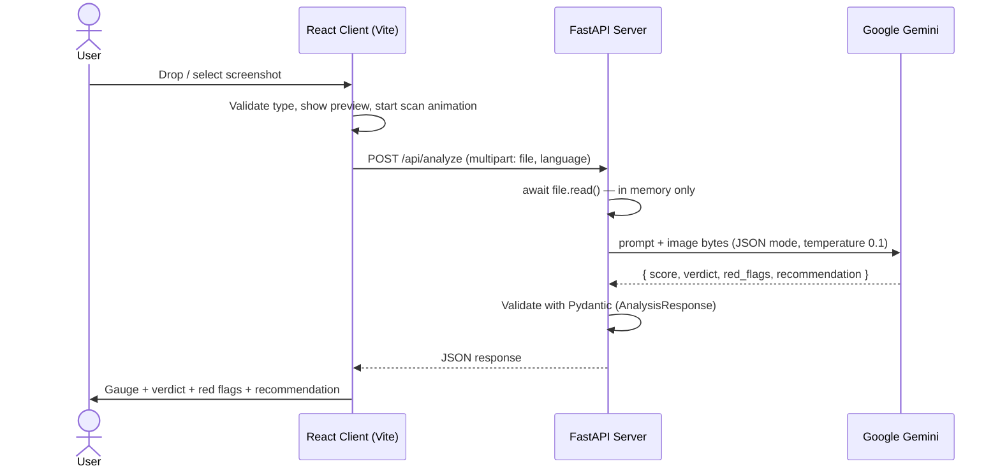

# PhishGuard AI

PhishGuard AI is a web app that detects phishing attempts from screenshots.
The user uploads an image (for example a screenshot of an email, an SMS or a login page), and the system sends it to a Google Gemini vision model. The model returns a risk score, a verdict, a list of red flags and a recommendation on what to do.

**Live demo:** https://phishguardac.netlify.app

The project has two parts:

| Part | Folder | Stack |
|------|--------|-------|
| Frontend | repo root (`src/`) | React 19 + Vite 7 + Tailwind CSS 3 |
| Backend | `server-phishGuard/` | Python 3.13 + FastAPI + Google GenAI SDK |

---

## Features

- **Drag & drop image upload** or click to browse, with a preview. Supports PNG, JPG and JPEG.
- **Scan animation**: a "laser" line sweeps over the image while status messages rotate ("Analyzing Branding...", "Checking URLs...", "Evaluating Tone...").
- **Two-layer AI analysis**:
  - *Visual analysis*: logos, fonts and colors that don't match the brand, suspicious form layouts, missing security indicators.
  - *Text analysis*: social engineering, urgent language, threats, spelling mistakes, suspicious domains and email addresses.
- **Results report**: a semicircle gauge with a 1–10 score in color (green, yellow, red), the verdict, the list of red flags and a recommendation.
- **Bilingual**: English and Hebrew, including RTL layout. The language is also sent to the server, so the model answers in the selected language.
- **Dark/light mode**: the choice is saved in `localStorage`.
- **Privacy**: a notice asks the user to crop out personal information before uploading. On the server, the image is processed in memory only and never written to disk.

---

## Architecture



In production the frontend is served by Netlify and the backend runs on Render. The browser talks to the Render server directly:

```
Browser  →  Netlify   (index.html, JS, CSS)
Browser  →  Render    (POST /api/analyze)  →  Gemini
```

---

## Project Structure

```
cli-phishGuard/
├── index.html
├── package.json
├── vite.config.js
├── tailwind.config.js          # darkMode: 'class'
├── postcss.config.js
├── eslint.config.js
├── render.yaml                 # Render Blueprint for the backend
├── .env.production             # VITE_API_BASE_URL for production builds (the Render URL)
├── .env.local                  # VITE_API_BASE_URL for local dev (not committed)
├── .claude/skills/             # Claude instructions: interaction, secure-arch, visualizer
├── public/
│   └── favicon.svg             # Shield-and-hook icon
├── src/
│   ├── main.jsx                # Entry point
│   ├── App.jsx                 # Wraps ThemeProvider and LanguageProvider and holds the result
│   ├── index.css               # Tailwind + scan-line animation
│   ├── components/
│   │   ├── Header.jsx          # Title, dark mode toggle and language toggle
│   │   ├── ImageUploader.jsx   # Drag & drop, preview, scan and API call
│   │   └── AnalysisResults.jsx # Score gauge and report
│   ├── contexts/
│   │   ├── ThemeContext.jsx    # Dark/light mode
│   │   └── LanguageContext.jsx # Translations (en/he), RTL/LTR direction
│   └── services/
│       └── api.js              # fetch wrapper (get, post, uploadFile)
│
└── server-phishGuard/          # Backend (same repo)
    ├── main.py                 # FastAPI app, CORS, endpoints
    ├── models/schemas.py       # AnalysisResponse (Pydantic)
    ├── services/gemini_service.py  # Prompt, Gemini call and response parsing
    ├── services/rate_limiter.py    # In-memory sliding-window rate limiter
    ├── check.py                # Helper script: prints the models available in Gemini
    ├── requirements.txt
    ├── .gitignore              # Excludes .env, .venv and __pycache__
    ├── .env                    # GEMINI_API_KEY, PORT (not committed)
    └── .claude/skills/         # Claude instructions: ai-specialist, fastapi-arch
```

> **Note:** the frontend and backend live in the same repo. `render.yaml` sets `server-phishGuard` as the Render service's root directory.

---

## API

### `GET /`
Health check. Returns:
```json
{ "message": "PhishGuard API is running" }
```

### `POST /api/analyze`
Analyzes an image.

**Request** (`multipart/form-data`):

| Field | Type | Required | Description |
|-------|------|----------|-------------|
| `file` | file | yes | The image to analyze: PNG or JPEG, up to 10 MB. The type is checked by the file's content (magic bytes), not by its Content-Type |
| `language` | string | no (default `en`) | Response language, `en` or `he` |

**Rate limits:** up to 10 scans per minute per IP address, and up to 30 scans per minute for the whole server. The limits are kept in memory, so they apply to each server instance separately and reset on restart.

**Response** (`200 OK`):
```json
{
  "score": 8,
  "verdict": "Phishing",
  "red_flags": [
    "Sender domain does not match the brand",
    "Urgent language: 'Your account will be suspended in 24 hours'"
  ],
  "recommendation": "Do not click the link. Delete the message and report it."
}
```

| Field | Meaning |
|-------|---------|
| `score` | Integer 1–10 (1 = definitely safe, 10 = definitely phishing) |
| `verdict` | `Safe` (1–3), `Suspicious` (4–7) or `Phishing` (8–10). Always in English, whatever the language; the client translates it |
| `red_flags` | List of red flags (may be empty), in the selected language |
| `recommendation` | Actionable advice for the user, in the selected language |

**Error codes:**

| Code | When |
|------|------|
| `400` | The uploaded file is empty, or `language` is not `en`/`he` |
| `411` | The `Content-Length` header is missing |
| `413` | The file is larger than 10 MB |
| `415` | The file is not a PNG or JPEG |
| `422` | The `file` field is missing (FastAPI validation) |
| `429` | Rate limit exceeded (with `Retry-After: 60`) |
| `502` | The Gemini call failed, or the response was not valid JSON / not in the expected shape |
| `503` | `GEMINI_API_KEY` is not set on the server |

---

## Frontend: How It Works

### State flow in `ImageUploader`

```
IDLE ──(file chosen)──▶ UPLOADING ──(FileReader done)──▶ SCANNING ──┬─▶ RESULT
                                                                    └─▶ ERROR
            ▲                                                        │
            └──────────────────────(Cancel)──────────────────────────┘
```

1. **IDLE**: the drag & drop area waits for a file.
2. **UPLOADING**: the file is validated (PNG/JPG/JPEG only, up to 10 MB) and read as a Data URL for the preview.
3. **SCANNING**: a dark overlay, an animated scan line and messages that rotate every 1.5 seconds are shown. At the same time a single request is sent to `/api/analyze` with the current language. `Cancel` aborts the request itself (`AbortController`), and choosing a new file cancels a scan that is still running.
4. **RESULT / ERROR**: the result is passed to `App` through `onScanComplete`. On error, a translated message is shown based on the status code: 413 (file too large), 415 (unsupported file type), 429 (too many scans), and a generic message otherwise.

### `AnalysisResults`
- `SemiCircleGauge` is a semicircle SVG gauge. Its color depends on the score: up to 3 green, up to 6 yellow, above 6 red.
- The verdict is shown through `t(verdict.toLowerCase())`, so it appears in the selected language.
- The component scrolls itself to the center of the screen when it appears.
- `red_flags` are shown as red warning cards, and the recommendation is shown in a separate box.

### Contexts
- **`ThemeContext`**: adds or removes the `dark` class on `<html>` and saves the choice in `localStorage`.
- **`LanguageContext`**: holds the `en` and `he` translation dictionaries and a `t(key)` function, updates `document.documentElement.dir` and saves the choice in `localStorage`.

---

## Backend: How It Works

- **`main.py`**: creates the FastAPI app, configures CORS and runs Uvicorn on the port from `PORT` (default 8000), so it fits deployment on Render.
- **Ephemeral processing**: the image is read with `await file.read()` straight into memory and never written to disk. By default Starlette spools files over 1 MB to a temporary file on disk, so `MultiPartParser.spool_max_size` is set above the upload limit.
- **Request guard (`guard_analyze_requests`)**: a middleware that checks `Content-Length` and the rate limit before the request body is read. It is registered before `CORSMiddleware`, so 411/413/429 responses also carry CORS headers and the browser sees the real status code.
- **`RateLimiter`** (`services/rate_limiter.py`): an in-memory sliding window. The per-IP limit is checked first and only then the global limit, so a single client can't use up the shared budget.
- **`GeminiService`**:
  - Model: `gemini-3.5-flash-lite`.
  - The Gemini call is async (`client.aio`), so the server handles several scans in parallel.
  - `temperature=0.1` and `response_mime_type="application/json"`, so the model returns JSON.
  - The prompt defines an analysis framework (visual and textual), a strict output format, score ranges for each verdict, and an instruction to write `red_flags` and `recommendation` in the requested language while the keys and the verdict stay in English.
  - The response is parsed and validated against `AnalysisResponse`. Missing fields get default values (score 5, `Suspicious`).

---

## Running Locally

### Requirements
- Node.js (a version supported by Vite 7)
- Python 3.13
- A Google Gemini API key

### 1. Backend

```powershell
cd server-phishGuard
python -m venv .venv
.venv\Scripts\activate
pip install -r requirements.txt
```

Create `server-phishGuard/.env`:
```env
GEMINI_API_KEY=your-gemini-api-key
PORT=8000
```
Note: if `GEMINI_API_KEY` is also set as a Windows environment variable, that value wins over `.env`.

Run:
```powershell
python main.py
```
The server starts at `http://localhost:8000`. Interactive docs are available at `http://localhost:8000/docs`.

To check that the key works and see which models are available:
```powershell
python check.py
```

### 2. Frontend

In the repo root, create `.env.local`:
```env
VITE_API_BASE_URL=http://localhost:8000
```
(If the variable is not set, the default is `http://localhost:8000`.)

```powershell
npm install
npm run dev
```
The app starts at `http://localhost:5173`.

### Frontend scripts

| Command | Description |
|---------|-------------|
| `npm run dev` | Dev server with HMR |
| `npm run build` | Production build into `dist/` |
| `npm run preview` | Serve the build locally |
| `npm run lint` | ESLint |

---

## Deployment

Every push to GitHub redeploys both parts automatically.

### Backend on Render
- Created from `render.yaml` as a Blueprint (**New → Blueprint** in the Render dashboard). The file sets the root directory, the build command and the start command, and asks for `GEMINI_API_KEY` in the dashboard so the key never goes into the repo.
- Start command: `uvicorn main:app --host 0.0.0.0 --port $PORT --forwarded-allow-ips="*"`. The `--forwarded-allow-ips` flag lets the rate limiter see the user's real IP behind Render's proxy; without it every user would look like one IP. That IP comes from `X-Forwarded-For` and can be spoofed, so the global limit is the safeguard in that case. Setting a quota on the key in Google AI Studio is also recommended.
- On the free plan the service sleeps after 15 minutes without traffic, so the first scan after that can take up to a minute.

### Frontend on Netlify
- The site is imported from the GitHub repo. Build command `npm run build`, publish directory `dist`.
- The Render URL is set in `.env.production`. Vite bakes it into the JS bundle at build time, and it takes priority over `.env.local` in production builds.
- CORS allows any origin of the form `https://<name>.netlify.app` (through `allow_origin_regex`). To lock the server to a single site, replace the regex with the site's full URL.

---

## Known Issues and Improvements

1. **The color thresholds don't match the verdict thresholds.** On the gauge, a score of 7 is shown in red, but according to the prompt 4–7 is `Suspicious`.
2. **Leftovers:**
   - `src/App.css` and `src/assets/react.svg` are leftovers from the Vite template and are not used.
   - The `critical` translation key is not used.
