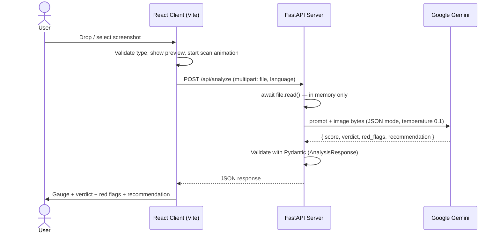

# PhishGuard AI

PhishGuard AI היא אפליקציית ווב שמזהה ניסיונות פישינג מתוך צילומי מסך.
המשתמש מעלה תמונה (למשל צילום של מייל, SMS או דף התחברות), והמערכת שולחת אותה למודל ראייה של Google Gemini. המודל מחזיר ציון סיכון, הכרעה, רשימת סימנים מחשידים והמלצה מה לעשות.

הפרויקט בנוי משני חלקים:

| חלק | תיקייה | טכנולוגיה |
|------|---------|------------|
| צד לקוח (Frontend) | תיקיית השורש (`src/`) | React 19 + Vite 7 + Tailwind CSS 3 |
| צד שרת (Backend) | `server-phishGuard/` | Python 3.13 + FastAPI + Google GenAI SDK |

---

## יכולות עיקריות

- **העלאת תמונה ב-Drag & Drop** או בלחיצה, עם תצוגה מקדימה. נתמכים קבצי PNG, JPG ו-JPEG.
- **אנימציית סריקה**: קו "לייזר" שעובר על התמונה, והודעות סטטוס מתחלפות ("Analyzing Branding...", "Checking URLs...", "Evaluating Tone...").
- **ניתוח AI כפול**:
  - *ניתוח ויזואלי*: לוגו, פונטים וצבעים שלא תואמים למותג, מבנה טפסים חשוד, מחוון אבטחה חסר.
  - *ניתוח טקסטואלי*: הנדסה חברתית, שפה דחופה, איומים, שגיאות כתיב, דומיינים וכתובות מייל חשודים.
- **דוח תוצאות**: מד חצי-עיגול עם ציון 1–10 בצבעים (ירוק, צהוב, אדום), ההכרעה, רשימת הסימנים המחשידים והמלצה.
- **דו-לשוניות**: אנגלית ועברית, כולל מעבר ל-RTL. השפה נשלחת גם לשרת, כך שהמודל עונה בשפה שנבחרה.
- **מצב כהה/בהיר**: הבחירה נשמרת ב-`localStorage`.
- **פרטיות**: הודעה שמבקשת מהמשתמש לחתוך מידע אישי לפני ההעלאה. בשרת התמונה מעובדת בזיכרון בלבד ולא נשמרת לדיסק.

---

## ארכיטקטורה



---

## מבנה הפרויקט

```
cli-phishGuard/
├── index.html
├── package.json
├── vite.config.js
├── tailwind.config.js          # darkMode: 'class'
├── postcss.config.js
├── eslint.config.js
├── .env.local                  # VITE_API_BASE_URL (לא נכנס ל-git)
├── .claude/skills/             # הנחיות ל-Claude: interaction, secure-arch, visualizer
├── src/
│   ├── main.jsx                # נקודת הכניסה
│   ├── App.jsx                 # עוטף ב-ThemeProvider ו-LanguageProvider ומחזיק את התוצאה
│   ├── index.css               # Tailwind + אנימציית scan-line
│   ├── components/
│   │   ├── Header.jsx          # כותרת, כפתור מצב כהה וכפתור שפה
│   │   ├── ImageUploader.jsx   # Drag & Drop, תצוגה מקדימה, סריקה וקריאה ל-API
│   │   └── AnalysisResults.jsx # מד הציון והדוח
│   ├── contexts/
│   │   ├── ThemeContext.jsx    # מצב כהה/בהיר
│   │   └── LanguageContext.jsx # תרגומים (en/he), כיוון RTL/LTR
│   └── services/
│       └── api.js              # עטיפה ל-fetch (get, post, uploadFile)
│
└── server-phishGuard/          # צד השרת (באותו ריפו)
    ├── main.py                 # אפליקציית FastAPI, CORS, endpoints
    ├── models/schemas.py       # AnalysisResponse (Pydantic)
    ├── services/gemini_service.py  # הפרומפט, הקריאה ל-Gemini ופענוח התשובה
    ├── services/rate_limiter.py    # הגבלת קצב בזיכרון (חלון זמן נע)
    ├── check.py                # סקריפט עזר: מדפיס את המודלים הזמינים ב-Gemini
    ├── requirements.txt
    ├── .gitignore              # מחריג את .env, .venv ו-__pycache__
    ├── .env                    # GEMINI_API_KEY, PORT (לא נכנס ל-git)
    └── .claude/skills/         # הנחיות ל-Claude: ai-specialist, fastapi-arch
```

> **שימו לב:** צד הלקוח וצד השרת נמצאים באותו ריפו. בפריסה מגדירים ב-Render את `server-phishGuard` כ-Root Directory של השירות.

---

## ה-API

### `GET /`
בדיקת תקינות. מחזיר:
```json
{ "message": "PhishGuard API is running" }
```

### `POST /api/analyze`
ניתוח תמונה.

**בקשה** (`multipart/form-data`):

| שדה | סוג | חובה | תיאור |
|------|------|-------|--------|
| `file` | קובץ | כן | התמונה לניתוח: PNG או JPEG, עד 10MB. הסוג נבדק לפי תוכן הקובץ (magic bytes), לא לפי ה-Content-Type |
| `language` | string | לא (ברירת מחדל `en`) | שפת התשובה, `en` או `he` |

**הגבלת קצב:** עד 10 סריקות בדקה לכל כתובת IP, ועד 30 סריקות בדקה לכל השרת. המגבלות נשמרות בזיכרון, כך שהן חלות על כל מופע של השרת בנפרד ומתאפסות בהפעלה מחדש.

**תשובה** (`200 OK`):
```json
{
  "score": 8,
  "verdict": "Phishing",
  "red_flags": [
    "Sender domain does not match the brand",
    "Urgent language: 'Your account will be suspended in 24 hours'"
  ],
  "recommendation": "Do not click the link. Delete the message and report it."
}
```

| שדה | משמעות |
|------|---------|
| `score` | מספר שלם 1–10 (1 = בטוח לגמרי, 10 = פישינג ודאי) |
| `verdict` | `Safe` (1–3), `Suspicious` (4–7) או `Phishing` (8–10), בשפה שנבחרה |
| `red_flags` | רשימת הסימנים המחשידים (יכולה להיות ריקה) |
| `recommendation` | המלצה מעשית למשתמש |

**קודי שגיאה:**

| קוד | מתי |
|-----|------|
| `400` | הקובץ שהועלה ריק, או ש-`language` אינו `en`/`he` |
| `411` | חסרה כותרת `Content-Length` |
| `413` | הקובץ גדול מ-10MB |
| `415` | הקובץ אינו PNG או JPEG |
| `422` | חסר השדה `file` (ולידציה של FastAPI) |
| `429` | חריגה מהגבלת הקצב (עם `Retry-After: 60`) |
| `502` | הקריאה ל-Gemini נכשלה, או שהתשובה לא הייתה JSON תקין / במבנה הצפוי |
| `503` | `GEMINI_API_KEY` לא מוגדר בשרת |

---

## צד הלקוח: איך זה עובד

### זרימת המצבים ב-`ImageUploader`

```
IDLE ──(בחירת קובץ)──▶ UPLOADING ──(FileReader סיים)──▶ SCANNING ──┬─▶ RESULT
                                                                   └─▶ ERROR
            ▲                                                       │
            └──────────────────────(Cancel)─────────────────────────┘
```

1. **IDLE**: אזור ה-Drag & Drop ממתין לקובץ.
2. **UPLOADING**: הקובץ נבדק (PNG/JPG/JPEG בלבד, עד 10MB) ונקרא כ-Data URL לתצוגה מקדימה.
3. **SCANNING**: מוצגים שכבה כהה, קו סריקה מונפש והודעות שמתחלפות כל 1.5 שניות. במקביל נשלחת בקשה אחת ל-`/api/analyze` יחד עם השפה הנוכחית. `Cancel` מבטל את הבקשה עצמה (`AbortController`), ובחירת קובץ חדש מבטלת סריקה שעדיין רצה.
4. **RESULT / ERROR**: התוצאה מועברת ל-`App` דרך `onScanComplete`. בשגיאה מוצגת הודעה מתורגמת לפי קוד השגיאה: 413 (קובץ גדול מדי), 415 (סוג קובץ לא נתמך), 429 (יותר מדי סריקות), והודעה כללית בכל מקרה אחר.

### `AnalysisResults`
- `SemiCircleGauge` הוא מד SVG בצורת חצי עיגול. הצבע נקבע לפי הציון: עד 3 ירוק, עד 6 צהוב, מעל 6 אדום.
- הקומפוננטה גוללת את עצמה למרכז המסך כשהיא מופיעה.
- `red_flags` מוצגים ככרטיסי אזהרה אדומים, וההמלצה מוצגת בתיבה נפרדת.

### Contexts
- **`ThemeContext`**: מוסיף או מסיר את המחלקה `dark` על `<html>` ושומר את הבחירה ב-`localStorage`.
- **`LanguageContext`**: מחזיק מילון תרגומים ל-`en` ול-`he` ופונקציית `t(key)`, מעדכן את `document.documentElement.dir` ושומר את הבחירה ב-`localStorage`.

---

## צד השרת: איך זה עובד

- **`main.py`**: יוצר את אפליקציית FastAPI, מגדיר CORS ומריץ Uvicorn על הפורט מ-`PORT` (ברירת מחדל 8000), כדי שיתאים לפריסה ב-Render.
- **עיבוד ללא שמירה (Ephemeral)**: התמונה נקראת עם `await file.read()` ישירות לזיכרון ולא נכתבת לדיסק. כברירת מחדל Starlette כותב קבצים מעל 1MB לקובץ זמני בדיסק, ולכן `MultiPartParser.spool_max_size` מוגדר מעל מגבלת ההעלאה.
- **שכבת הגנה (`guard_analyze_requests`)**: middleware שבודק את `Content-Length` ואת הגבלת הקצב עוד לפני שגוף הבקשה נקרא. הוא רשום לפני `CORSMiddleware`, כדי שגם תשובות 411/413/429 יכללו כותרות CORS והדפדפן יראה את קוד השגיאה האמיתי.
- **`RateLimiter`** (`services/rate_limiter.py`): חלון זמן נע בזיכרון. קודם נבדקת המגבלה לכל IP ורק אחר כך המגבלה הכללית, כדי שלקוח אחד לא ינצל את כל התקציב המשותף.
- **`GeminiService`**:
  - מודל: `gemini-2.5-flash-lite`.
  - הקריאה ל-Gemini אסינכרונית (`client.aio`), כך שהשרת מטפל בכמה סריקות במקביל.
  - `temperature=0.1` ו-`response_mime_type="application/json"`, כך שהמודל מחזיר JSON.
  - הפרומפט מגדיר מסגרת ניתוח (ויזואלי וטקסטואלי), פורמט פלט קשיח, טווחי ציון לכל הכרעה, והוראה לכתוב את הערכים בשפה המבוקשת בזמן שהמפתחות נשארים באנגלית.
  - התשובה מפוענחת ועוברת ולידציה מול `AnalysisResponse`. לשדות חסרים יש ערכי ברירת מחדל (ציון 5, `Suspicious`).

---

## הרצה מקומית

### דרישות
- Node.js (גרסה שתומכת ב-Vite 7)
- Python 3.13
- מפתח API של Google Gemini

### 1. צד השרת

```powershell
cd server-phishGuard
python -m venv .venv
.venv\Scripts\activate
pip install -r requirements.txt
```

יוצרים קובץ `server-phishGuard/.env`:
```env
GEMINI_API_KEY=your-gemini-api-key
PORT=8000
```
הערה: אם `GEMINI_API_KEY` מוגדר גם במשתני הסביבה של Windows, הערך שם גובר על `.env`.

מריצים:
```powershell
python main.py
```
השרת יעלה בכתובת `http://localhost:8000`. תיעוד אינטראקטיבי זמין ב-`http://localhost:8000/docs`.

אפשר לבדוק שהמפתח עובד ולראות אילו מודלים זמינים:
```powershell
python check.py
```

### 2. צד הלקוח

בתיקיית השורש יוצרים `.env.local`:
```env
VITE_API_BASE_URL=http://localhost:8000
```
(אם המשתנה לא מוגדר, ברירת המחדל היא `http://localhost:8000`.)

```powershell
npm install
npm run dev
```
האפליקציה תעלה בכתובת `http://localhost:5173`.

### סקריפטים של צד הלקוח

| פקודה | תיאור |
|--------|--------|
| `npm run dev` | שרת פיתוח עם HMR |
| `npm run build` | בנייה לפרודקשן לתיקיית `dist/` |
| `npm run preview` | הרצה מקומית של ה-build |
| `npm run lint` | ESLint |

---

## פריסה

הקוד מוכן לתצורה הבאה:
- **צד שרת ב-Render**: הפורט נקרא מ-`PORT`, והשרת מאזין על `0.0.0.0`. פקודת ההפעלה היא `python main.py`, שמגדירה `forwarded_allow_ips="*"` כדי שהגבלת הקצב תראה את כתובת ה-IP האמיתית של המשתמש מאחורי ה-proxy של Render. אם מפעילים עם `uvicorn main:app` צריך להוסיף `--forwarded-allow-ips="*"`, אחרת כל המשתמשים ייראו כמו IP אחד. כתובת ה-IP הזו נלקחת מ-`X-Forwarded-For` ולכן אפשר לזייף אותה. המגבלה הכללית היא ההגנה במקרה כזה, ומומלץ להגדיר גם מכסה למפתח ב-Google AI Studio.
- **צד לקוח ב-Netlify**: מגדירים `VITE_API_BASE_URL` לכתובת השרת ב-Render. ה-CORS מאפשר כל כתובת מהצורה `https://<name>.netlify.app` (דרך `allow_origin_regex`). כדי לנעול את השרת לאתר אחד בלבד, מחליפים את ה-regex בכתובת המלאה של האתר.

---

## בעיות ידועות ונקודות לשיפור

1. **ספי הצבע לא תואמים לספי ההכרעה.** במד, ציון 7 מוצג באדום, אבל לפי הפרומפט 4–7 הם `Suspicious`.
2. **שאריות ותיעוד לא מעודכן:**
   - `src/App.css` ו-`src/assets/react.svg` הם שאריות של תבנית Vite ולא בשימוש.
   - ב-`index.html` האייקון הוא עדיין הלוגו של Vite.
   - מפתחות התרגום `safe`, `suspicious`, `phishing` ו-`critical` לא בשימוש, כי ההכרעה מגיעה מהשרת כבר מתורגמת.
